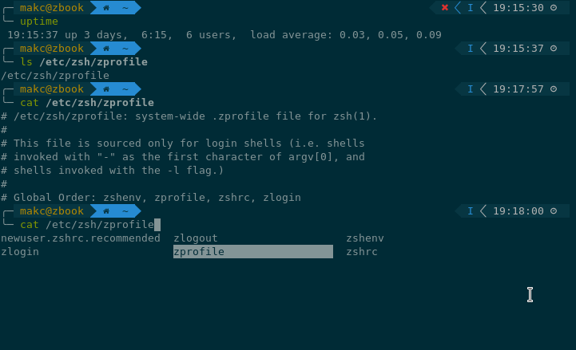

# dots
Userspace configuration

## Neovim

### Build neovim from source
```bash
git clone https://github.com/neovim/neovim.git
sudo apt install ninja-build gettext libtool libtool-bin autoconf automake cmake g++ pkg-config unzip
sudo apt install python-pip python3.7 python3-pip
make distclean
CMAKE_BUILD_TYPE=RelWithDebInfo make deps && CMAKE_BUILD_TYPE=RelWithDebInfo make
sudo make install
```
### Install vim-plug
```bash
curl -fLo ~/.local/share/nvim/site/autoload/plug.vim --create-dirs \
    https://raw.githubusercontent.com/junegunn/vim-plug/master/plug.vim
```
### Copy configuration
```bash
cp nvimrc ~/.config/nvim/init.vim
```

### Install neovim plugins dependencies
#### Install rust
```bash
curl https://sh.rustup.rs -sSf | sh
rustup component add rls rust-analysis rust-src
```
#### Install xclip
```bash
sudo apt install xclip, xsel
```


## Zsh


### Install zsh, git
```bash
apt install zsh, git
```

### Install zplug
```bash
curl -sL --proto-redir -all,https https://raw.githubusercontent.com/zplug/installer/master/installer.zsh | zsh
```

### Install zplug\zsh config
```bash
cp zshrc ~/.zshrc
chsh --shell /bin/zsh
```

### Install fonts
```bash
# clone
git clone https://github.com/powerline/fonts.git --depth=1
# install
cd fonts
./install.sh
# clean-up a bit
cd ..
rm -rf fonts

# install Nerd fonts
mkdir -p ~/.local/share/fonts
cd ~/.local/share/fonts && curl -fLo "DejaVu Sans Mono for Powerline Nerd Font Complete.otf" https://github.com/ryanoasis/nerd-fonts/raw/master/patched-fonts/DejaVuSansMono/complete/DejaVu%20Sans%20Mono%20Nerd%20Font%20Complete.otf
fc-cache -f -v
```
